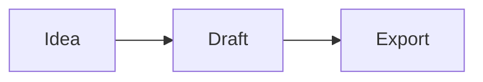

# Marp Presentation Template

A reusable [Marp](https://marp.app) template for technical talks, workshops, and training decks. It is intentionally Markdown-first: headings, lists, tables, blockquotes, fenced code blocks, and Marp directives should cover normal slide authoring.

## Setup

Use Node.js `24.18.0` (the version pinned in `.nvmrc` and `.node-version`):

```sh
fnm use
npm install
```

The common workflows also have Make targets; run `make help` to list them.

## Create A Deck Repository

The creation workflow updates `deck.config.json`, synchronizes generated files,
creates the GitHub repository, preserves the template repository as the
`template` remote, repoints `origin`, commits the deck, and pushes it:

```sh
npm run create-deck -- \
  --title "Temporal Fundamentals" \
  --description "A practical introduction to Temporal." \
  --repo-org CoderMana
```

The Make equivalent is:

```sh
make create TITLE="Temporal Fundamentals" \
  ARGS='--description "A practical introduction to Temporal." --repo-org CoderMana'
```

The original template-style invocation is also supported:

```sh
echo 'Temporal Fundamentals' > TITLE
./create-and-update-remote.sh \
  --description "A practical introduction to Temporal." \
  --repo-org CoderMana
```

The shell script is only a compatibility wrapper around `npm run create-deck`;
repository creation logic remains in `scripts/create-deck.mjs`.

Use `--dry-run` to inspect the derived metadata without changing files, Git
remotes, or GitHub. Use `--no-push` to create and configure the repository but
leave the initial commit local. The workflow requires authenticated `gh` and
uses the existing `origin` URL to choose SSH or HTTPS for the new remote.

## Preview

```sh
npm run preview
```

Open the local URL printed by Marp.

## Export

```sh
npm run html
npm run pdf
npm run pptx
```

Generated files are written to `dist/`. Each export (and `preview`) prepares the
theme, diagrams, metadata, and source-backed snippets first. HTML export also
copies `assets/` into `dist/`, so the deployed deck has its images and diagrams.

## Lint

```sh
npm run lint              # validate metadata and fail on slide overflow
npm run lint -- --dense   # also flag crammed-but-fitting slides (advisory)
```

The metadata check rejects stale generated fields, unresolved placeholders, and,
for non-template decks, an `origin` remote that does not match the configured
repository. The slide check renders every slide headlessly and reports overflow.

## Deck Metadata

`deck.config.json` is the source of truth for deck identity and publishing:

- title, description, author, and optional cover eyebrow
- URL slug
- GitHub repository organization and name
- hosting base domain (the custom domain is `<slug>.<baseDomain>`)

After editing it, synchronize generated front matter, title-slide copy, resource
links, `CNAME`, and package metadata:

```sh
npm run deck:sync
npm run deck:check
```

When creating a real deck from this template, set `isTemplate` to `false`.
Validation will then reject the starter title and verify that `origin` points at
the configured repository. Generated sections in `slides.md` are enclosed by
`deck:*` comments and should not be edited directly.

## Theme

The theme is authored in **Sass**: edit `themes/base.scss`, not `themes/base.css`.
`base.css` is a generated artifact and is **gitignored** - every npm script that
needs it (`preview`, `html`, `pdf`, `pptx`, `lint`) rebuilds it first via a `pre*`
hook, and CI does the same. Build it manually only when you use the theme directly
without an npm script - e.g. the VS Code Marp preview on a fresh clone:

```sh
npm run css
```

> Why a build script instead of plain `sass`? Marpit only inlines its built-in
> `default` theme when the file holds a bare `@import 'default';`, which Dart Sass
> refuses to emit. `scripts/build-theme.mjs` compiles the Sass and prepends that
> import (plus the `@theme` banner) afterward. See the comments in that file.

Theme tokens (colors, fonts) live at the top of `base.scss` as CSS custom
properties and Sass variables.

## Customize A New Deck

After copying this repository:

- Update `deck.config.json`, set `isTemplate` to `false`, and run `npm run deck:sync`.
- Replace images in `assets/images/`.
- Edit theme tokens at the top of `themes/base.scss`, then run `npm run css`.
- Keep useful layout examples and delete the rest.

## Slide Patterns

Use Marp directives in HTML comments:

```md
---
<!-- _class: section -->

# A new section
```

Available slide classes:

- `title` - cover slide
- `section` - section divider
- `split` - two-column content
- `image` - image-led slide
- `quote` - pull quote
- `caveat` - normal slide content with one consequential note anchored above the footer
- `cards` - three-card summary
- `code` - code-focused slide; add `code-tight` for longer listings
- `exercise` - workshop prompt
- `takeaway` - closing summary
- `cols-photo` - image beside vertically-centred text (`.cols` > `.col-media` + `.col-body`; add `media-right` to swap sides, `center-body` to centre the caption)
- `center` / `middle` - centre text horizontally / vertically (combine for both)
- `intro-photo` - a centred photo sized to sit under a heading
- `content-time` - the "Content > Time" icon row

Markdown conventions:

- Use `###### Eyebrow` for the small uppercase label on title and section slides.
- Use a normal paragraph after the main heading for lead copy.
- Use `> Blockquote` for callouts.
- Use `<!-- _class: quote -->` plus `> Quote text` for large quote slides.
- Use `<!-- _class: caveat -->` and make the final blockquote the caveat.
- Use a three-column Markdown table on `cards` slides.
- Use Marp background image syntax like `` for visual split slides.
- Use a `mermaid` fenced block for diagrams; it is rendered to SVG for every export.

HTML is still available if a specific deck needs a custom one-off layout, but the starter deck avoids it.

## Mermaid Diagrams

Keep diagrams in `slides.md` as Mermaid source:

````md

````

`npm run diagrams` creates ignored, hash-addressed SVG files in
`assets/generated/mermaid/`. The normal preview, lint, and export commands run
this automatically, so HTML, PDF, and PPTX all use the same diagram.

## Source-backed Code Samples

For a slide snippet that must match real source, add a marker before its fenced
code block and bracket the source with `// #region` comments:

````md
<!-- snippet: examples/snippets/greeting.js#greeting -->
```js
// generated when the deck is built
```
````

```js
// #region greeting
export function greeting(name) { return `Hello, ${name}!`; }
// #endregion
```

`npm run snippets` replaces the marked block during deck preparation. Use
`node scripts/build-snippets.mjs --check` in automation when you only want to
detect stale snippets.

## Authoring Assets

Prefer source-native content whenever it remains readable:

- Use fenced code blocks for short code that should be discussed line by line.
- Use terminal recordings only when timing or interaction is the point; otherwise
  paste the commands and output as text.
- Use screenshots for product interfaces or output that cannot be reproduced
  cleanly in Markdown. Crop them tightly and remove unrelated UI.
- Compress raster images before committing them. Use SVG for diagrams, logos,
  and icons when available.
- Put image or content attribution on the slide using the `image-credit` and
  `content-credit` classes. The final paragraph (or final two paragraphs when
  both classes are present) becomes the credit line.

Useful tools include [Carbon](https://carbon.now.sh/) for exceptional code
screenshots, [VHS](https://github.com/charmbracelet/vhs) or
[asciinema](https://asciinema.org/) for terminal recordings, and
[ImageOptim](https://imageoptim.com/) or equivalent tooling for raster
compression. Do not turn ordinary readable text into an image.

## Motion (live HTML deck only)

The HTML deck (`npm run preview` / `npm run html`) animates; PDF/PPTX exports
render the final settled frame, so they are unaffected.

- **Slide transitions** come from the `transition:` front-matter directive
  (`transition: fade 0.4s`). Override per slide with `<!-- _transition: coverflow -->`
  (also `zoom`, `slide`, etc. - see the Marp transition list).
- **Entrance animations** are built in: headings drop in, body content rises in
  just behind them, and divider slides (`title`/`section`/`exercise`/`takeaway`)
  pop. No markup needed.
- **Disable motion**: viewers can turn on the OS "Reduce motion" setting (kills
  both entrances and transitions). In-deck, add `<!-- _class: no-anim -->` to one
  slide or `class: no-anim` to the front-matter to stop entrances; comment the
  `transition:` directive to stop transitions.

Preview needs a browser with the View Transitions API (e.g. Chrome).

## Progressive reveal

Marp reveals list items one click at a time when the bullet marker is `*`
(unordered) or `1)` (ordered); plain `-` and `1.` show everything at once. Use the
fragmented form only on build-up slides (sequential steps, takeaways) - not on
tables, code, or reference lists.

## Code highlighting themes

Code blocks use a swappable highlight.js palette. The default is tuned to the
template accent; switch per slide (or deck-wide via `class:`) with one of:

```md
<!-- _class: code-onedark -->   <!-- also: code-tomorrow, code-github, code-monokai -->
```
