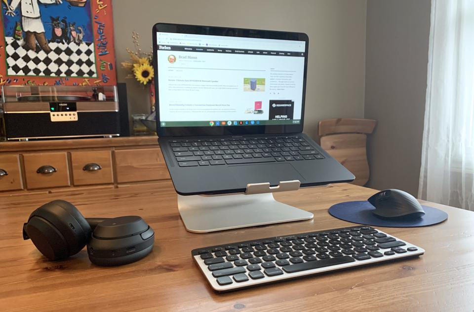
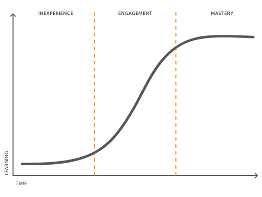

<!-- _class: title -->
<!-- _transition: coverflow 0.7s -->

<!-- deck:title:start -->

###### Eyebrow

# Presentation Template

Reusable Marp template for technical talks and training.

###### Gaurav Agarwal

<!-- deck:title:end -->

---

<!-- _class: cols-photo -->

<div class="cols">
<div class="col-media">


</div>
<div class="col-body">

## Gaurav Agarwal

Software Engineer & Product Developer

Director of Engineering & Founder @ https://codermana.com

ex-Tarka Labs, ex-BrowserStack, ex-ThoughtWorks

</div>
</div>

---

<!-- _class: cols-photo media-right center-body -->

<div class="cols">
<div class="col-media">


</div>
<div class="col-body">

*What we wanted*

</div>
</div>

---

<!-- _class: cols-photo center-body -->

<div class="cols">
<div class="col-media">



</div>
<div class="col-body">

*What we got*

</div>
</div>

---

## As an instructor

* I promise to make this class as interactive as possible
* I will use as many resources as available to keep you engaged
* I will ensure everyone's questions are addressed

---

## What I need from you

* Be vocal
  - Let me know if there are any audio/video issues ASAP
  - Feel free to interrupt me and ask questions
* Be punctual
* Give feedback
* Work on the exercises
* Be *on mute* unless you are speaking

---

<!-- _class: center middle intro-photo -->

## Class progression



---

<!-- _class: center middle -->

Here you are trying to *learn* something, while here your **brain** is doing you a favor by making sure the learning doesn't stick.

---

### Some tips

* Slow down: stop and think
  - Listen for the questions and answer
* Do the exercises
  - They are not add-ons; they are not optional
* There are no dumb questions
* Drink water. Lots of it.

---

### Some tips (continued)

* Take notes
  - Try repetitive, spaced-out learning
* Talk about it out loud
* Listen to your brain
* *Experiment*

---

<!-- _class: center middle content-time -->

<div class="content-time-rule" aria-label="Content is greater than time">
  <span class="content-time-item">
    
    <span>Content</span>
  </span>
  <span class="content-time-symbol">&gt;</span>
  <span class="content-time-item">
    
    <span>Time</span>
  </span>
</div>

---

<!-- _class: center middle -->

## Show of hands

*Yay's in chat*

---

<!-- _class: section -->

###### Start Here

# The shape of the talk

Use this deck as a working scaffold. Replace the examples with your content and keep the layout classes.

---

# Agenda

1. Why this topic matters
2. The model or framing
3. A concrete walkthrough
4. Practice, discussion, or next steps

> Keep agenda slides short. The value is in orientation, not detail.

---

<!-- _class: speaker -->


###### Speaker

## Gaurav Agarwal

Software Engineer & Product Developer

Director of Engineering & Founder @ https://codermana.com

ex-Tarka Labs, ex-BrowserStack, ex-ThoughtWorks

---

<!-- _class: section -->

###### Section

# A clear section break

Section slides should reset attention and name the next idea plainly.

---

<!-- _class: split -->


## Split layout

Use this when text needs a supporting visual.

- Keep the left side textual
- Put evidence on the right
- Make one point per slide

---

<!-- _class: image -->

## Image-led slide


Use images when they carry the point directly. Avoid decorative filler.

---

<!-- _class: cards -->

# Three related ideas

| Context | Move | Result |
| --- | --- | --- |
| What the audience needs to know before the detail lands. | The practical technique, decision, or shift you want to teach. | The observable outcome or tradeoff that follows from the move. |

---

<!-- _class: quote -->

> Make the important thing impossible to miss.

Good quote slides create a pause. Use them sparingly.

---

<!-- _class: code -->

## Code example

```go
package main

import "fmt"

func main() {
  fmt.Println("Hello, world!")
}
```

> Code slides work best when the snippet is short enough to discuss line by line.

---

<!-- _class: caveat -->

## State the useful rule

Use the body of the slide for the normal case, recommendation, or primary
explanation.

> Caveat: reserve this anchored note for a constraint or exception that materially changes how the audience should apply the advice.

---

<!-- _class: exercise -->

# Exercise

Work in pairs for 10 minutes.

1. Identify the main tradeoff.
2. Write down one concrete example.
3. Share the decision you would make.

---

<!-- _class: takeaway -->

# Takeaways

* One idea the audience should remember
* One habit they can practice immediately
* One resource they can use after the session

> `*` bullets reveal one click at a time. Use plain `-` for lists that should appear all at once.

---

<!-- deck:resources:start -->

## Resources

Code

https://github.com/CoderMana/presentation-template-marp

Slides

https://template-marp.slides.algogrit.com

<!-- deck:resources:end -->
